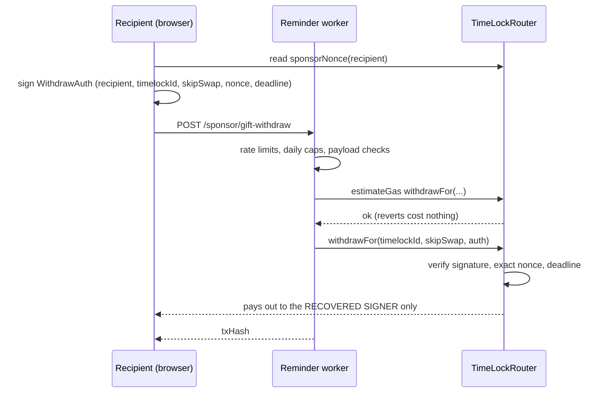

# Heirloom Gifts

Heirloom is a presentation layer over the deployed `TimeLockRouter`
contract: a sealed gift IS a timelock of the contract's `Gift` type,
created with `createTimelockedGift`. No new contract was deployed for the
feature; everything below runs on the audited router that also powers
beneficiary timelocks.

## Escrow: two lanes, one seal

- **ETH gifts** ride the router's storage-token swap lane. The sealed ETH
  is converted into a whitelisted storage token at creation (WETH
  preferred: a 1:1 wrap with no DEX dependency) and held by the router's
  vault. At claim time the withdrawal unwraps back to ETH, so the
  recipient receives ETH.
- **USDC gifts** ride the plain ERC-20 lane. `createTimelockedGift`
  performs `safeTransferFrom` into the `TimeLockERC20` vault at sealing,
  after an exact-amount approval. The recipient receives the tokens
  themselves.

Both lanes escrow at creation. The giver keeps no allowance, no custody,
and no recall path: the unlock date and recipient are immutable contract
state.

On-chain metadata is deliberately generic (`name: "Gift"`, empty
`giftName`): personal information never touches the chain.

## The claim link and the privacy model

A claim link is `/heirloom/{chainId}/{timelockId}#g=<base64url payload>`.

- The **path** carries only public on-chain identifiers. The gift page
  reads everything factual (recipient, unlock time, assets, claimed
  state) from the subgraph for that chain.
- The **fragment** (`#g=...`) carries the recipient name, giver name, and
  personal message. Fragments are never sent in HTTP requests, so no
  server (ours, an email provider's link scanner, anyone's) sees the
  note. The gift page decodes it locally.
- The **query** may carry two non-personal hints: `o=<occasion>` selects
  the themed link-preview card (crawlers must see it, hence not in the
  fragment), and `paper=1` marks paper-key gifts so the page shows the
  paper guidance however the visitor arrived.

Paper-key gifts get a second, address-based entry:
`/heirloom/for/{giftWalletAddress}` — the target of the QR printed on the
key sheet's COVER. The sheet must print before sealing, when no timelock
id exists yet, but the gift wallet's address is already known. The page
resolves the newest gift sealed to that address via the subgraph and
forwards to the canonical gift page, carrying the fragment through. The
cover QR embeds the personal payload in its fragment too, so a scanned
paper opens the page fully personalized.
- The sealing device also stores a **keepsake** (payload, occasion, card
  mode) in `localStorage`, keyed by chain and timelock id. This lets the
  gift's detail page rebuild the full link and the themed card later, on
  that device only. It is the same device-local posture as private legacy
  names: no server copy exists.

Whoever holds the link can view the gift. Only the on-chain recipient can
withdraw, regardless of who submits the transaction.

## Gasless claims: the sponsored withdrawal relay

The recipient signs an EIP-712 `WithdrawAuth` (free, no gas) and the
reminder-worker's relayer submits `TimeLockRouter.withdrawFor`, paying the
network fee.

Why this cannot be drained:

- **The contract is the judge**: `withdrawFor` recovers the signer from
  the typed-data signature and pays out strictly to that recovered
  address. A forged or replayed request reverts; the relayer's
  `estimateGas` catches it before any gas is spent.
- **Exact sequential nonce** (`sponsorNonce`) and a deadline bound every
  authorization to one use, soon.
- **Worker caps** bound the spend: a global daily relay cap, a per-gift
  daily cap, a gas-price ceiling, and per-IP rate limits. The numbers
  live in the reminder-worker configuration; at current mainnet fees a
  claim costs roughly a dollar of gas, and the worst full-saturation day
  is bounded to tens of dollars.
- The realistic abuse is cap exhaustion (sealing tiny gifts to yourself
  and claiming them sponsored), which burns the day's free-claim budget
  but never other people's funds. Self-paid claiming always remains
  available.

Availability is reported by `GET /sponsor/status` as a `gift` field,
separate from the legacy sponsor's readiness.

**Paper-key claims** ride the same relay with a different signer: the
claim page accepts the printed key directly (camera scan via the native
BarcodeDetector where available, typed otherwise), builds an in-memory
account from it, and signs the same `WithdrawAuth` locally. The key never
leaves the device and is never persisted; only the signature travels.
This path is sponsored-only by design, because the gift wallet holds the
escrowed gift but no ETH for gas.

## Email-addressed gifts (Turnkey)

A gift is sealed to an address, so "send it to an email" means "seal it
to the address that email controls". Two halves, one relay:

- **Seal side.** The giver signs an EIP-712 `GiftEmailWallet{emailHash,
  deadline}` (the hash rides in the message; the email itself only in
  the request body, over TLS) and the frontend calls the worker's
  `POST /gift/recipient-wallet`. The worker finds or creates a Turnkey
  **sub-organization** for that email, keyed by a salted hash, whose only
  root user is the email (email OTP authenticator) and which holds one
  Ethereum wallet. It returns the address; the seal transaction is the
  ordinary one. Per-IP limits and a daily creation cap bound the
  minting. The worker stores `emailHash -> subOrgId` only; the raw email
  rides the existing encrypted notify path, and the claim link carries
  `email=1`.
- **Claim side.** The gift page talks to Turnkey's Auth Proxy directly
  with two public IDs (organization and auth-proxy config): send the
  code, verify it, log the session in, then the embedded wallet signs
  the same `WithdrawAuth` the paper key signs. The signer seam in the
  claim hook is the only thing that changes; the relay and the contract
  do not know which kind of signer produced the signature.

Custody, stated plainly: the key lives in Turnkey's enclaves and signs
only after the email's owner verifies with the code; 10102's API key can
create sub-organizations but holds no authority inside them. This is a
step away from self-custody (the recipient depends on their inbox and on
Turnkey's service), which the user guide says in as many words. The
paper key stays the fully self-sovereign path.

Readiness is reported by `GET /sponsor/status` as `giftEmail` (all three
`TURNKEY_*` variables set on the worker); the create page offers the mode
only when it reads true, and the frontend has a kill switch
(`VITE_FEATURE_GIFT_EMAIL=false`).

## Notify emails

`POST /gift/notify` lets the GIVER register a recipient email with a
timing choice: "a gift is waiting" immediately, on a scheduled day of the
giver's choosing (`notify_at`, e.g. the birthday itself), or not at all —
plus "your gift just unlocked" on opening day in every mode.

- **Owner-signed EIP-712**: the signature covers the sha256 HASH of the
  payload (`GiftNotify2`), binding the exact content while keeping the
  email out of wallet signing prompts. The worker hashes the payload it
  receives, verifies the signature, and checks the signer against the
  timelock's on-chain owner via the subgraph. Only the actual giver can
  email anyone; this is the anti-spam core.
- **Claim-link origins are allowlisted** so a malicious payload cannot
  point victims at a phishing domain wearing our email template.
- **Encrypted at rest**: the payload (email, names, the full claim link
  including its fragment) is AES-GCM encrypted with a per-row derived
  key.
- **Crypto-shredded at maturity**: the unlock-day pass deletes every
  matured row, silently when the gift is already claimed, right after
  the unlock send otherwise. Encrypted personal data never outlives
  opening day (plus a retry window if the email proxy is down).
- **Dedupe survives deletion**: send idempotency lives in a separate
  ledger keyed by a hash of the email, so a deleted row can never re-arm
  a duplicate send, while correcting a typo'd address still gets its
  copy.

## Printable artifacts

All three artifacts render client-side on a canvas (no server round
trip) at Letter size, 200 dpi:

- **Key sheet**: a wrap-fold three-panel packet. The flat sheet renders
  the secret on the top panel, the occasion cover on the middle, and the
  "how to open" back panel rotated 180 degrees so it reads upright after
  folding. QR codes are generated with margin 2 and error correction M;
  the secret panel is always pure white for scan reliability.
- **Gift card**: occasion-themed certificate carrying the claim link QR
  and the personal message. Never the key, never the amount.
- **Gift record**: an austere factual document for the giver, headlined
  by fair market value on the sealing date (historical price lookup for
  past gifts, live price for same-day ones, an honest "no price source"
  line offline), with a not-tax-advice disclaimer.

Occasion designs (palettes, canvas-drawn motifs, greetings, message
templates) are a reviewed content pack; religious occasions use only
symbols customary on greeting cards.

## Known operational notes

- Wallet reputation engines can flag young contracts. The create page
  explains the caution in place and points at address verification; the
  false-positive appeal is an operational task tracked in the app
  repository's ops checklist.
- A gift is also visible as a `Gift`-type row in the giver's Timelock
  tab; the shield score deliberately does not credit outgoing gifts as a
  protection layer.
